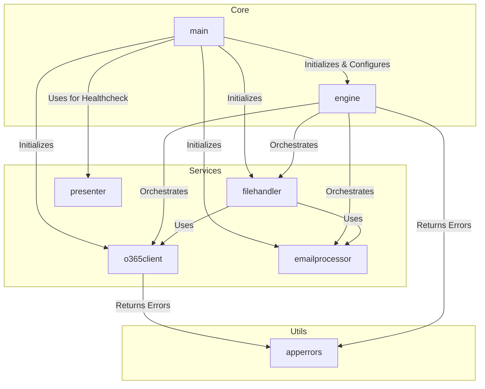
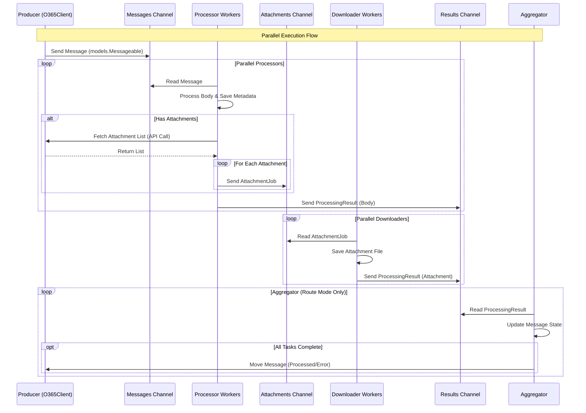
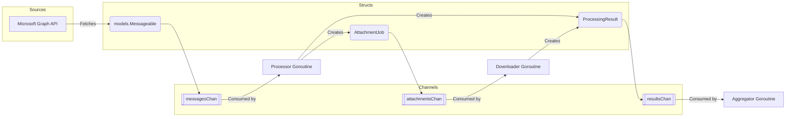

# System Visualizations

This document contains visual representations of the `o365mbx` application's architecture, flow, and data structures. These diagrams are generated using Mermaid syntax.

## 1. Package Dependency Map

This diagram illustrates the high-level architecture and how the different Go packages within the project interact. It highlights the central role of the `main` package in initialization and the `engine` package in orchestrating the core logic.

*   **Core**: The `main` entry point and the `engine` which drives the application.
*   **Services**: specialized modules for API interaction (`o365client`), file system operations (`filehandler`), and content processing (`emailprocessor`).
*   **Utils**: Shared utilities like error definitions.

## 2. Concurrency Model (Producer-Consumer)

This sequence diagram details the application's "heartbeat" — the parallel processing pipeline. It visualizes how the application maximizes throughput using Go's concurrency primitives.

*   **Producer**: Fetches messages from O365.
*   **Processors (W1)**: A pool of workers that process message bodies and discover attachments.
*   **Downloaders (W2)**: A separate pool of workers dedicated to downloading attachments.
*   **Aggregator**: (Route Mode only) Tracks completion of all parts of a message (body + attachments) before moving it to a destination folder.

## 3. Data Flow & Channel Structures

This diagram focuses on *what* data moves through the system. It maps the Go structs to the channels that transport them, providing a clear view of the data pipeline.

*   **messagesChan**: Carries `models.Messageable` objects from the API.
*   **attachmentsChan**: Carries `AttachmentJob` structs created by processors for downloaders.
*   **resultsChan**: Carries `ProcessingResult` structs to the aggregator for final status tracking.

